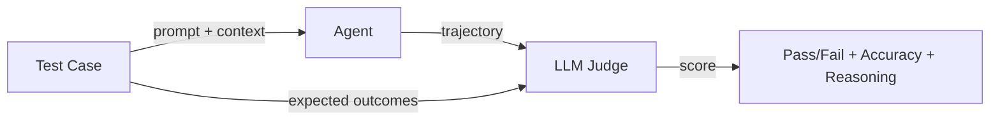

Agent Health evaluates AI agents by comparing their execution trajectories against expected outcomes using an LLM judge. This page explains the evaluation pipeline and core concepts.

## How evaluations work

An evaluation follows this flow:

1. A **test case** provides a prompt, context, and expected outcomes
2. The **agent** executes the prompt and produces a trajectory (sequence of steps)
3. An **LLM judge** compares the trajectory against expected outcomes
4. The judge returns a **score** with pass/fail status, accuracy, reasoning, and improvement suggestions



## Golden Path concept

A "Golden Path" is the expected trajectory an agent should follow to successfully complete a task. It defines:

- Which tools the agent should invoke
- What reasoning steps are expected
- What the final response should contain

The LLM judge doesn't require an exact match - it evaluates whether the agent's actual trajectory achieves the expected outcomes through reasonable steps, even if the specific path differs.

## LLM Judge output

Each evaluation produces a judge result with:

| Field | Description |
|-------|-------------|
| **Pass/Fail** | Whether the agent met the expected outcomes |
| **Accuracy** | Performance score (0-100%) |
| **Reasoning** | Detailed analysis of the agent's trajectory |
| **Improvements** | Suggestions for better agent performance |

## Demo Judge vs Production Judge

| | Demo Judge | Production Judge |
|---|-----------|-----------------|
| **Backend** | In-memory mock | AWS Bedrock |
| **Credentials** | None required | AWS credentials |
| **Scoring** | Simulated scores | Real LLM evaluation |
| **Use case** | Testing and exploration | Production evaluation |

To use the production judge, configure AWS credentials in your `.env` file:

```bash
AWS_REGION=us-west-2
AWS_ACCESS_KEY_ID=your_key
AWS_SECRET_ACCESS_KEY=your_secret
```

## Next steps

- [Test Cases](/docs/agent-health/evaluations/test-cases/) - create and manage evaluation scenarios
- [Experiments](/docs/agent-health/evaluations/experiments/) - run batch evaluations and compare results
