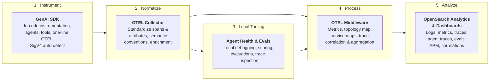
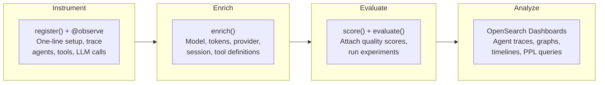

import { Aside, Steps } from '@astrojs/starlight/components';

This guide walks you through instrumenting an AI agent with the Python SDK, viewing traces in OpenSearch Dashboards, and scoring agent quality. By the end you'll have a working observability pipeline for your AI application.

## End-to-end platform

From code to insight - the platform covers the full AI observability lifecycle:



## What the SDK gives you

The GenAI Observability SDK handles the full lifecycle of agent observability:



| Capability | Function | What it does |
|---|---|---|
| **Pipeline setup** | `register()` | Configures OTEL tracer, exporter, and auto-instrumentation in one call |
| **Trace agents & tools** | `@observe` | Decorator/context manager that creates spans with GenAI semantic attributes |
| **Enrich spans** | `enrich()` | Sets model, tokens, provider, session ID, and other GenAI attributes on the active span |
| **Auto-instrument LLMs** | `register(auto_instrument=True)` | OpenAI, Anthropic, Bedrock, LangChain, and 20+ libraries traced automatically |
| **Score traces** | `score()` | Attaches evaluation scores to traces through the OTLP pipeline |
| **Run experiments** | `evaluate()` | Runs a task against a dataset with scorer functions, records everything as OTel spans |
| **Upload results** | `Experiment` | Uploads pre-computed eval results from RAGAS, DeepEval, pytest, or custom frameworks |
| **Query traces** | `OpenSearchTraceRetriever` | Retrieves stored traces from OpenSearch for evaluation pipelines |
| **AWS production** | `AWSSigV4OTLPExporter` | SigV4-signed exports to OpenSearch Ingestion or OpenSearch Service |

## Prerequisites

- Python 3.10+
- Docker (for the observability stack)
- An AI agent application (or use the example below)

## Walkthrough

<Steps>

1. **Install the SDK**

    ```bash
    pip install opensearch-genai-observability-sdk-py
    ```

    For auto-instrumentation of your LLM provider:
    ```bash
    pip install "opensearch-genai-observability-sdk-py[openai]"   # or [anthropic], [bedrock], etc.
    ```

2. **Start the observability stack**

    ```bash
    git clone https://github.com/opensearch-project/observability-stack.git
    cd observability-stack
    docker compose up -d
    ```

    This starts OpenSearch, Data Prepper, OTel Collector, Prometheus, and OpenSearch Dashboards.

3. **Instrument your agent**

    Add `register()` at startup and `@observe` on your functions:

    ```python
    from opensearch_genai_observability_sdk_py import register, observe, Op, enrich

    # One-line setup - connects to the local OTel Collector
    register(
        endpoint="http://localhost:4318/v1/traces",
        service_name="my-agent",
    )

    @observe(op=Op.EXECUTE_TOOL)
    def search_docs(query: str) -> list[dict]:
        """Search the knowledge base."""
        return [{"title": "Result 1", "content": "OpenSearch is a search engine"}]

    @observe(op=Op.INVOKE_AGENT)
    def my_agent(question: str) -> str:
        enrich(model="gpt-4o", provider="openai", session_id="session-123")
        docs = search_docs(question)
        answer = f"Based on {len(docs)} docs: {docs[0]['content']}"
        enrich(input_tokens=150, output_tokens=50)
        return answer

    # Run the agent
    result = my_agent("What is OpenSearch?")
    print(result)
    ```

    This produces a trace with:
    - A root span `invoke_agent my_agent` with model, token, and session attributes
    - A child span `execute_tool search_docs` with tool name and arguments
    - Auto-captured input/output on both spans

4. **View traces in OpenSearch Dashboards**

    Open [http://localhost:5601](http://localhost:5601) and navigate to **Observability > Agent Traces**.

    You'll see your agent trace with the full span tree, token usage, latency, and input/output content. Expand the trace to see the tool call nested under the agent invocation.

    <Aside type="tip">
    Traces take 2-5 seconds to appear after the `BatchSpanProcessor` flushes. Use `register(batch=False)` during development to see spans immediately.
    </Aside>

5. **Score agent quality**

    After reviewing a trace, attach a quality score:

    ```python
    from opensearch_genai_observability_sdk_py import score

    score(
        name="relevance",
        value=0.95,
        trace_id="<trace-id-from-dashboards>",
        label="relevant",
        explanation="Answer correctly references OpenSearch documentation",
    )
    ```

    Scores appear as evaluation spans in the same trace, queryable alongside the agent spans.

6. **Run an experiment** (optional)

    Test your agent against a dataset with automated scoring:

    ```python
    from opensearch_genai_observability_sdk_py import evaluate, EvalScore

    def relevance_scorer(input, output, expected) -> EvalScore:
        is_match = expected.lower() in output.lower()
        return EvalScore(name="relevance", value=1.0 if is_match else 0.0)

    result = evaluate(
        name="my_agent_v1",
        task=my_agent,
        data=[
            {"input": "What is OpenSearch?", "expected": "search engine"},
            {"input": "What is OTEL?", "expected": "opentelemetry"},
        ],
        scores=[relevance_scorer],
    )
    print(result.summary)  # avg, min, max per metric
    ```

</Steps>

## What's next

- [Python SDK reference](/docs/send-data/ai-agents/python/) - full API documentation for `register`, `observe`, `enrich`, and AWS auth
- [Evaluation & Scoring](/docs/ai-observability/evaluation/) - `score()`, `evaluate()`, `Experiment`, and `OpenSearchTraceRetriever` in depth
- [Agent Tracing UI](/docs/ai-observability/agent-tracing/) - explore traces, graphs, and timelines in OpenSearch Dashboards
- [Agent Health](/docs/agent-health/) - evaluate agents with Golden Path comparison, LLM judges, and batch experiments
