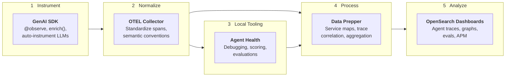

The Observability Stack provides end-to-end tooling for AI agent observability - from instrumenting your code to viewing traces, scoring quality, and running evaluations.

## End-to-end platform

## Capabilities

- **Agent tracing** - visualize LLM agent execution as trace trees, DAG graphs, and timelines
- **GenAI semantic conventions** - standard `gen_ai.*` attributes for model, tokens, tools, and sessions
- **Evaluation & scoring** - attach quality scores to traces, run experiments against datasets
- **Trace retrieval** - query stored traces from OpenSearch for evaluation pipelines
- **Auto-instrumentation** - OpenAI, Anthropic, Bedrock, LangChain, and 20+ libraries traced automatically
- **MCP server** - query OpenSearch from AI agents via the built-in Model Context Protocol server

## Getting started

Start here for a hands-on walkthrough from `pip install` to seeing traces and scoring quality:

- **[Getting Started](/docs/ai-observability/getting-started/)** - instrument an agent, view traces, score quality in 5 minutes

## Instrument

Send agent trace data to the observability stack:

- [Python SDK](/docs/send-data/ai-agents/python/) - `@observe`, `enrich()`, auto-instrumentation, AWS SigV4
- [TypeScript SDK](/docs/send-data/ai-agents/typescript/) - coming soon
- [AI Agents overview](/docs/send-data/ai-agents/) - why use the SDK vs manual OTel

## Analyze

Explore traces in OpenSearch Dashboards:

- [Agent Tracing](/docs/ai-observability/agent-tracing/) - the Agent Traces UI, span tables, detail flyouts
- [Agent Graph & Path](/docs/ai-observability/agent-tracing/graph/) - DAG visualization, trace tree, and timeline views

## Evaluate

Score agent quality and run experiments:

- [Evaluation & Scoring](/docs/ai-observability/evaluation/) - `score()`, `evaluate()`, `Experiment`, trace retrieval
- **[Agent Health](/docs/agent-health/)** - Golden Path trajectory comparison, LLM judge scoring, batch experiments via UI and CLI

## Connect

- [MCP Server](/docs/mcp/) - query OpenSearch from AI agents via MCP
