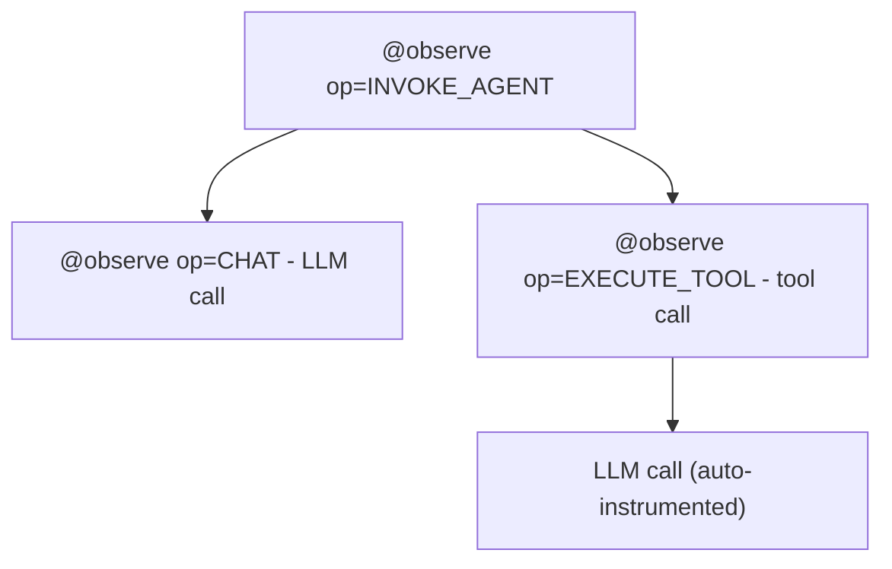

import { Aside } from '@astrojs/starlight/components';

`opensearch-genai-observability-sdk-py` instruments Python AI agent applications using standard OpenTelemetry. It configures the OTEL pipeline in one call, provides a unified `observe()` primitive for tracing agents and tools, and enriches spans with GenAI semantic convention attributes automatically.

- **PyPI:** [`opensearch-genai-observability-sdk-py`](https://pypi.org/project/opensearch-genai-observability-sdk-py/)
- **Python:** 3.10+
- **Source:** [github.com/opensearch-project/genai-observability-sdk-py](https://github.com/opensearch-project/genai-observability-sdk-py)

## Installation

```bash
pip install opensearch-genai-observability-sdk-py
```

Auto-instrumentation for LLM providers is opt-in:

```bash
pip install "opensearch-genai-observability-sdk-py[openai]"
pip install "opensearch-genai-observability-sdk-py[anthropic]"
pip install "opensearch-genai-observability-sdk-py[bedrock]"
pip install "opensearch-genai-observability-sdk-py[langchain]"
pip install "opensearch-genai-observability-sdk-py[llamaindex]"
pip install "opensearch-genai-observability-sdk-py[otel-instrumentors]"  # all providers
pip install "opensearch-genai-observability-sdk-py[opensearch]"          # trace retrieval
pip install "opensearch-genai-observability-sdk-py[all]"                 # everything
```

## API overview

The SDK exports these functions and classes. This page covers the instrumentation APIs. Evaluation APIs are documented in [Evaluation & Scoring](/docs/ai-observability/evaluation/).

| Export | Purpose | Docs |
|---|---|---|
| `register()` | Configure OTEL pipeline | [This page](#register) |
| `observe()` | Trace agents, tools, LLM calls | [This page](#observe) |
| `Op` | Operation name constants | [This page](#op-constants) |
| `enrich()` | Set GenAI attributes on active span | [This page](#enrich) |
| `score()` | Attach evaluation scores to traces | [This page](#score) |
| `AWSSigV4OTLPExporter` | SigV4-signed OTLP exporter | [This page](#aws-authentication) |
| `evaluate()` | Run agent against dataset with scorers | [Evaluation & Scoring](/docs/ai-observability/evaluation/#evaluate---run-experiments) |
| `Experiment` | Upload pre-computed eval results | [Evaluation & Scoring](/docs/ai-observability/evaluation/#experiment---upload-pre-computed-results) |
| `EvalScore` | Scorer return type | [Evaluation & Scoring](/docs/ai-observability/evaluation/#evalscore-dataclass) |
| `OpenSearchTraceRetriever` | Query stored traces from OpenSearch | [Evaluation & Scoring](/docs/ai-observability/evaluation/#opensearchtraceretriever---query-stored-traces) |

## Quick start

```python
from opensearch_genai_observability_sdk_py import register, observe, Op, enrich

register(endpoint="http://localhost:4318/v1/traces", service_name="my-agent")

@observe(op=Op.EXECUTE_TOOL)
def get_weather(city: str) -> dict:
    return {"city": city, "temp": 22, "condition": "sunny"}

@observe(op=Op.INVOKE_AGENT)
def assistant(query: str) -> str:
    enrich(model="gpt-4o", provider="openai")
    data = get_weather("Paris")
    return f"{data['condition']}, {data['temp']}C"

result = assistant("What's the weather?")
```

---

## `register()`

Configures the OTEL tracing pipeline. Call once at startup before any tracing occurs.

```python
from opensearch_genai_observability_sdk_py import register

register(
    endpoint="http://localhost:4318/v1/traces",
    service_name="my-app",
)
```

| Parameter | Type | Default | Description |
|---|---|---|---|
| `endpoint` | `str` | Data Prepper default | OTLP endpoint URL. Reads `OTEL_EXPORTER_OTLP_TRACES_ENDPOINT` or `OTEL_EXPORTER_OTLP_ENDPOINT` if not set. |
| `protocol` | `"http"` \| `"grpc"` | inferred from URL | Force transport. `grpc://` -> gRPC, `grpcs://` -> gRPC+TLS, else HTTP. |
| `service_name` | `str` | `"default"` | Attached as `service.name`. Reads `OTEL_SERVICE_NAME`. |
| `project_name` | `str` | | Alias for `service_name`. Reads `OPENSEARCH_PROJECT`. |
| `service_version` | `str` | | Sets `service.version`. Reads `OTEL_SERVICE_VERSION`. |
| `batch` | `bool` | `True` | `True` = `BatchSpanProcessor`, `False` = `SimpleSpanProcessor`. |
| `auto_instrument` | `bool` | `True` | Discover and activate installed OTel instrumentor packages. |
| `exporter` | `SpanExporter` | | Custom exporter. Overrides `endpoint`, `protocol`, `headers`. |
| `set_global` | `bool` | `True` | Register as the global `TracerProvider`. |
| `headers` | `dict` | | Additional HTTP headers for the OTLP exporter. |

Returns the configured `TracerProvider`.

### Endpoint schemes

| URL scheme | Transport |
|---|---|
| `http://` or `https://` | OTLP HTTP (default) |
| `grpc://` | OTLP gRPC, insecure |
| `grpcs://` | OTLP gRPC with TLS |

### Examples

```python
# Self-hosted with Data Prepper
register(service_name="my-agent")

# OTel Collector on localhost
register(endpoint="http://localhost:4318/v1/traces", service_name="my-agent")

# gRPC
register(endpoint="grpc://localhost:4317", service_name="my-agent")

# AWS OpenSearch Ingestion with SigV4
from opensearch_genai_observability_sdk_py import AWSSigV4OTLPExporter
exporter = AWSSigV4OTLPExporter(
    endpoint="https://pipeline.us-east-1.osis.amazonaws.com/v1/traces",
    service="osis", region="us-east-1",
)
register(service_name="my-agent", exporter=exporter)
```

---

## `observe()`

The unified tracing primitive. Works as a **decorator** (sync, async, generator, async generator) and as a **context manager**.

### Usage forms

```python
# Bare decorator - span name = function qualname
@observe
def my_function():
    ...

# Parameterized - set operation type, name, span kind
@observe(name="weather_agent", op=Op.INVOKE_AGENT)
def run_agent(query: str) -> str:
    ...

# Context manager - for inline tracing blocks
with observe("llm_call", op=Op.CHAT) as span:
    response = llm.chat(messages)
```

### Parameters

| Parameter | Type | Default | Description |
|---|---|---|---|
| `name` | `str` | function `__qualname__` | Span entity name. |
| `op` | `str` | | Sets `gen_ai.operation.name`. Span name becomes `"{op} {name}"`. |
| `kind` | `SpanKind` | `INTERNAL` | OTel `SpanKind`. |
| `name_from` | `str` | | Function parameter whose runtime value becomes the span name. |

### `Op` constants

| Constant | Value | Use for |
|---|---|---|
| `Op.INVOKE_AGENT` | `"invoke_agent"` | Agent invocations and orchestration |
| `Op.EXECUTE_TOOL` | `"execute_tool"` | Tool/function calls |
| `Op.CHAT` | `"chat"` | LLM chat completions |
| `Op.CREATE_AGENT` | `"create_agent"` | Agent initialization |
| `Op.RETRIEVAL` | `"retrieval"` | RAG retrieval |
| `Op.EMBEDDINGS` | `"embeddings"` | Embedding generation |
| `Op.GENERATE_CONTENT` | `"generate_content"` | Content generation |
| `Op.TEXT_COMPLETION` | `"text_completion"` | Text completions |

Any custom string also works for `op`.

### Automatic behavior

In decorator mode, `observe()` automatically:

- **Captures input** as `gen_ai.input.messages` (or `gen_ai.tool.call.arguments` for tools). Skips `self`/`cls`.
- **Captures output** as `gen_ai.output.messages` (or `gen_ai.tool.call.result` for tools). Won't overwrite if already set.
- **Records errors** as span status `ERROR` with an exception event.
- **Sets entity attributes** - `gen_ai.agent.name` for agents, `gen_ai.tool.name` + `gen_ai.tool.type="function"` for tools.

All values truncated at 10,000 characters.

### Span hierarchy



### Dispatcher pattern

When the tool name is only known at call time:

```python
@observe(op=Op.EXECUTE_TOOL, name_from="tool_name")
def execute_tool(self, tool_name: str, arguments: dict) -> dict:
    return self._tools[tool_name](**arguments)
# Produces: "execute_tool web_search", "execute_tool calculator", etc.
```

### Async support

```python
@observe(op=Op.EXECUTE_TOOL)
async def async_search(query: str) -> list:
    return await search_api.query(query)
```

---

## `enrich()`

Adds GenAI semantic convention attributes to the currently active span. Call inside `@observe`-decorated functions or `with observe(...)` blocks.

```python
@observe(op=Op.CHAT, name="llm_call")
def call_llm(messages: list) -> str:
    response = openai.chat.completions.create(model="gpt-4o", messages=messages)
    enrich(
        model="gpt-4o",
        provider="openai",
        input_tokens=response.usage.prompt_tokens,
        output_tokens=response.usage.completion_tokens,
        finish_reason=response.choices[0].finish_reason,
    )
    return response.choices[0].message.content
```

### Parameter-to-attribute mapping

| Parameter | OTel Attribute |
|---|---|
| `model` | `gen_ai.request.model` |
| `provider` | `gen_ai.provider.name` |
| `input_tokens` | `gen_ai.usage.input_tokens` |
| `output_tokens` | `gen_ai.usage.output_tokens` |
| `total_tokens` | `gen_ai.usage.total_tokens` |
| `response_id` | `gen_ai.response.id` |
| `finish_reason` | `gen_ai.response.finish_reasons` |
| `temperature` | `gen_ai.request.temperature` |
| `max_tokens` | `gen_ai.request.max_tokens` |
| `session_id` | `gen_ai.conversation.id` |
| `agent_id` | `gen_ai.agent.id` |
| `agent_description` | `gen_ai.agent.description` |
| `tool_definitions` | `gen_ai.tool.definitions` |
| `system_instructions` | `gen_ai.system_instructions` |
| `input_messages` | `gen_ai.input.messages` |
| `output_messages` | `gen_ai.output.messages` |
| `**extra` | key used as-is |

All parameters are optional. Only provided values are set.

---

## Auto-instrumentation

`register()` discovers and activates installed instrumentor packages. Install the extra for your provider - no code changes needed.

| Provider / framework | Extra |
|---|---|
| OpenAI, OpenAI Agents | `[openai]` |
| Anthropic | `[anthropic]` |
| Amazon Bedrock | `[bedrock]` |
| LangChain | `[langchain]` |
| LlamaIndex | `[llamaindex]` |
| Cohere | `[cohere]` |
| Mistral | `[mistral]` |
| Groq | `[groq]` |
| Ollama | `[ollama]` |
| Google Generative AI + Vertex AI | `[google]` |
| All of the above + 20 more | `[otel-instrumentors]` |

```python
register(auto_instrument=False)  # to disable
```

---

## `score()`

Attaches an evaluation score to a trace or span. Scores are emitted as OTEL spans through the same OTLP pipeline - no separate client or index needed.

```python
from opensearch_genai_observability_sdk_py import score

# Score an entire trace
score(name="relevance", value=0.92, trace_id="abc123...",
      explanation="Response addresses the user's query")

# Score a specific span
score(name="accuracy", value=0.95, trace_id="abc123...", span_id="def456...",
      label="pass")
```

| Parameter | Type | Description |
|---|---|---|
| `name` | `str` | Metric name, e.g. `"relevance"`, `"factuality"`. |
| `value` | `float` | Numeric score. |
| `trace_id` | `str` | Hex trace ID to score. Omit for standalone scores. |
| `span_id` | `str` | Hex span ID for span-level scoring. |
| `label` | `str` | Human-readable label, e.g. `"pass"`. |
| `explanation` | `str` | Evaluator rationale (truncated to 500 chars). |
| `response_id` | `str` | LLM completion ID for correlation. |
| `attributes` | `dict` | Additional span attributes. |

For running evaluations at scale (`evaluate()`, `Experiment`, `OpenSearchTraceRetriever`), see [Evaluation & Scoring](/docs/ai-observability/evaluation/).

---

## AWS authentication

For AWS-hosted endpoints, use `AWSSigV4OTLPExporter` to sign requests with SigV4:

```python
from opensearch_genai_observability_sdk_py import AWSSigV4OTLPExporter, register

exporter = AWSSigV4OTLPExporter(
    endpoint="https://pipeline.us-east-1.osis.amazonaws.com/v1/traces",
    service="osis",           # "osis" for OSIS, "es" for OpenSearch Service
    region="us-east-1",       # auto-detected if omitted
)
register(service_name="my-agent", exporter=exporter)
```

Credentials: `AWS_ACCESS_KEY_ID`/`AWS_SECRET_ACCESS_KEY` -> `~/.aws/credentials` -> IAM role/IMDS.

<Aside type="caution">
SigV4 + gRPC is not supported. Use `https://` for AWS endpoints.
</Aside>

---

## Environment variables

| Variable | Description | Default |
|---|---|---|
| `OTEL_EXPORTER_OTLP_TRACES_ENDPOINT` | OTLP traces endpoint | |
| `OTEL_EXPORTER_OTLP_ENDPOINT` | OTLP endpoint (appends `/v1/traces`) | Data Prepper default |
| `OTEL_SERVICE_NAME` | Service name | `"default"` |
| `OPENSEARCH_PROJECT` | Project name (fallback) | `"default"` |
| `OTEL_SERVICE_VERSION` | Service version | |

---

## Related links

- [AI Observability - Getting Started](/docs/ai-observability/getting-started/) - end-to-end walkthrough
- [Evaluation & Scoring](/docs/ai-observability/evaluation/) - score traces, run experiments
- [Trace Retrieval](/docs/ai-observability/evaluation/#opensearchtraceretriever---query-stored-traces) - query stored traces from OpenSearch
- [Agent Traces](/docs/ai-observability/agent-tracing/) - viewing traces in OpenSearch Dashboards
- [GenAI semantic conventions](https://opentelemetry.io/docs/specs/semconv/gen-ai/) - OTel spec reference
